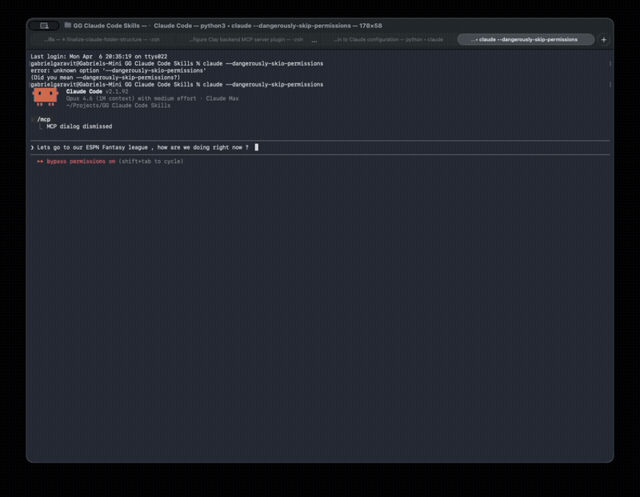
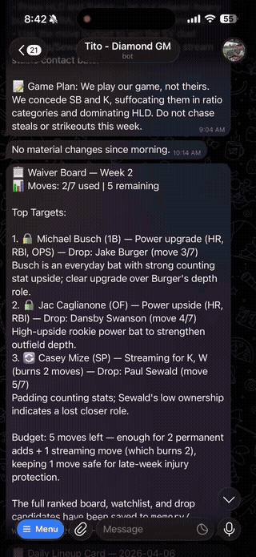

# ESPN Fantasy Baseball — AI-Powered League Manager

Turn your H2H Categories league into a conversation. Scout opponents, find free agents, analyze trades, run your auction draft, and track your season — all through Claude.

> "Who should I pick up at SS this week?"
>
> Claude checks your roster, identifies your weak categories, searches free agents at SS, compares them against your current player, and recommends a pickup that flips two categories in your matchup.

### Claude Code

<p align="center">
  
</p>

### OpenClaw

<p align="center">
  
</p>

## What You Can Do

### Weekly Management
- **Matchup scouting** — See your H2H category breakdown, identify swing categories, and get lineup recommendations to flip close ones
- **Free agent search** — Find pickups filtered by position, ranked by category impact (not generic points)
- **Waiver wire alerts** — Monitor league transactions, spot dropped players worth claiming
- **Weekly prep** — Full Monday briefing: matchup preview, injury report, start/sit decisions, streaming targets

### Trades & Strategy
- **Trade analysis** — Evaluate any trade with a category-by-category impact table and a clear accept/decline verdict
- **Category strategy** — Map your strengths and weaknesses across all 14 categories, decide what to punt, and build a path to 8+ category wins per week
- **Season outlook** — Big-picture analysis: win/loss trajectory, playoff positioning, roster improvement plan

### Auction Draft ($280 budget)
- **Live draft board** — Track every pick, price paid, and remaining budgets across all teams
- **Budget strategy** — Stars-and-scrubs vs balanced, position scarcity alerts (C, SS), nomination targets
- **Bid guidance** — For each nominated player: max bid, walk-away price, and alternative targets if you lose

### Automated Monitoring (Cron Jobs)

Don't wait until you remember to check — set up scheduled agents to monitor your league on autopilot. Platforms like **OpenClaw** support cron-based agent execution, so the plugin checks your league on a schedule and alerts you when something needs attention.

**Example schedules:**

| Schedule | What it does | Cron |
|---|---|---|
| **Lineup check** | Flag injured starters, empty slots, bench players who should start | Daily at 8am |
| **Waiver wire scout** | Monitor drops, cross-reference with roster needs and weak categories | Every 6 hours |
| **Weekly matchup prep** | Scout opponent, identify swing categories, streaming targets, game plan | Monday 9am |

**Example prompts for your scheduled agents:**

- *"Check my roster for injured players, empty slots, or anyone on the bench who should be starting. Flag any issues."*
- *"Check recent league activity for dropped players worth picking up. Cross-reference with my roster needs and weak categories. Only alert me if there's a clear upgrade."*
- *"Run a full weekly prep: scout my opponent, identify swing categories, check for streaming pitchers, and give me a game plan for the week."*

This turns the plugin from reactive (you ask, it answers) to proactive (it watches your league and tells you when to act).

### Cross-Session Memory

The plugin remembers your season across conversations:

| What it remembers | Why it matters |
|---|---|
| **Matchup history** | Win/loss record per opponent, category breakdowns by week |
| **Category trends** | Which stats you're dominant/weak/improving in over time |
| **Roster moves** | Every add, drop, and trade — avoids re-adding players you already tried |
| **Watchlist** | Players you're tracking for future pickup |
| **Draft picks** | Full auction history with bid amounts |
| **Preferences** | Your punt strategy, draft approach, and other strategic decisions |

Memory is powered by a local SQLite database (`~/.espn-fantasy/memory.db`) with 14 MCP tools across 7 tables. At the start of each session, the agent loads your full context — matchup history, category trends, roster moves, and preferences — so it picks up where you left off.

## How It Works

Two MCP servers working together:

**ESPN Fantasy MCP** (30 tools + 5 resources) — Connects to ESPN's API for live league data: rosters, standings, matchups, free agents, player stats, trades, draft board, scoring categories, probable pitchers, and transaction counts. Deployed on Railway via SSE or runs locally via stdio.

**Memory MCP** (14 tools) — Local SQLite server that persists matchup results, roster moves, category assessments, watchlist, draft picks, and user preferences across sessions. Runs locally via stdio.

**8 Skills** orchestrate both servers into complete workflows. When you ask "How's my matchup this week?", the matchup-scout skill calls `get_standings` → `get_matchup` → `get_team_roster` (opponent) → `get_my_roster` → loads memory for historical context → produces a category scoreboard with recommendations.

### The 14 Scoring Categories

The league uses **H2H Categories** — you win individual stat categories each week, not total points. This shapes every recommendation:

| Hitting (7) | Pitching (7) |
|---|---|
| AVG | WHIP *(lower wins)* |
| HR | ERA *(lower wins)* |
| OPS | K (strikeouts) |
| R (runs) | W (wins) |
| RBI | L *(lower wins)* |
| SB (stolen bases) | SV (saves) |
| B_SO *(lower wins)* | HLD (holds) |

## Built On

- [**cwendt94/espn-api**](https://github.com/cwendt94/espn-api) — Python library for ESPN's Fantasy API (rosters, standings, matchups, player data). This repo is a fork with the MCP server, CLI, and plugin layered on top.
- [**kalil0321/reverse-api-engineer**](https://github.com/kalil0321/reverse-api-engineer) — Captures ESPN browser traffic to discover undocumented API endpoints beyond what espn-api covers. Used to map additional league data and build more powerful tooling.

---

## Quick Start

### Prerequisites

- Python 3.10+
- [uv](https://docs.astral.sh/uv/) (`curl -LsSf https://astral.sh/uv/install.sh | sh`)
- ESPN Fantasy Baseball account

### Setup

```bash
git clone https://github.com/garavitgabriel/espn-api.git
cd espn-api
uv sync
```

### Authenticate

**Option A — Browser login (easiest):**

```bash
uv sync --extra browser              # first time only
uv run playwright install chromium   # first time only
uv run espn auth login
```

A browser opens, you log in to ESPN, and cookies are captured automatically.

**Option B — Manual token:**

Get your cookies from ESPN Fantasy > DevTools > Application > Cookies, then:

```bash
uv run espn auth token <ESPN_S2> <ESPN_SWID>
```

**Option C — `.env` file:**

```bash
cp .env.example .env   # edit with your values
```

### Activate

| Platform | How |
|---|---|
| **Claude Code** | Open the project — auto-discovered via `.claude-plugin/` |
| **Claude Desktop** | Add to `claude_desktop_config.json` (see below) |
| **Claude Cowork** | `uv run espn build-plugin build --target claude --url <SSE_URL>`, upload zip |
| **OpenClaw** | `./install-openclaw.sh` (see [docs/openclaw-setup.md](docs/openclaw-setup.md)) |

<details>
<summary>Claude Desktop config</summary>

```json
{
  "mcpServers": {
    "espn-baseball": {
      "command": "uv",
      "args": ["run", "--project", "/path/to/espn-api", "espn-mcp"]
    }
  }
}
```

File location: `~/Library/Application Support/Claude/claude_desktop_config.json`
</details>

---

## Skills

Each skill orchestrates multiple MCP tools into a complete workflow:

| Skill | Triggers | What it does |
|---|---|---|
| **matchup-scout** | "matchup", "how am I doing", "opponent" | Category scoreboard, opponent scouting, press/protect/concede recommendations |
| **free-agent-finder** | "free agent", "pickup", "waiver" | Position-filtered search ranked by category impact, pickup/drop verdicts |
| **trade-analyzer** | "trade", "should I accept", "give X for Y" | Category-by-category impact table, net swing analysis, accept/decline verdict |
| **draft-assistant** | "draft", "auction", "bid", "budget" | Live draft board tracking, bid guidance, budget pacing, position scarcity alerts |
| **weekly-prep** | "weekly prep", "set my lineup", "Monday briefing" | Matchup preview, injury scan, start/sit, streaming targets, week plan |
| **category-strategist** | "category analysis", "what should I punt" | Rate all 14 categories, identify punt targets, build path to 8+ wins |
| **waiver-wire-scout** | "who got dropped", "league activity" | Monitor transactions, spot opportunities, avoid re-adding failed pickups |
| **season-outlook** | "season outlook", "playoff chances" | Win/loss trajectory, category trends, playoff math, improvement plan |

## CLI

```bash
uv run espn standings
uv run espn roster
uv run espn matchup --week 5
uv run espn free-agents --position SS --size 10
uv run espn player "Shohei Ohtani"
uv run espn compare "Shohei Ohtani" "Aaron Judge"
uv run espn trade --give "Player A" --receive "Player B"

# League info
uv run espn schedule --team "Gabriel"
uv run espn settings
uv run espn search "Ohtani"
uv run espn scoreboard --week 5

# Daily lineup decisions
uv run espn probable-pitchers                      # today's MLB starters with handedness
uv run espn sp-schedule "George Kirby"             # next scheduled start
uv run espn vs-team "Freddie Freeman" --opponent SEA  # BvP vs a specific team
uv run espn weekly-moves                           # add/drop count in the current period
uv run espn activity --team "Rolling Bunts" --period 4  # filter league activity

# Draft day
uv run espn scoring
uv run espn slots
uv run espn draft
uv run espn needs

# Auth
uv run espn auth login                        # browser login
uv run espn auth token <ESPN_S2> <ESPN_SWID>  # manual token
uv run espn auth status
uv run espn auth logout

# Plugin bundle
uv run espn build-plugin build --target openclaw
uv run espn build-plugin build --target claude --url https://your-app.up.railway.app/sse

uv run espn --help
```

## MCP Tools (30)

<details>
<summary>ESPN Fantasy MCP — live league data</summary>

| Tool | Description |
|---|---|
| `get_my_roster` | Your team's full roster with stats and injury status |
| `get_team_roster` | Any team's roster by name |
| `get_matchup` | Current or specific week matchup with H2H category breakdown |
| `get_standings` | League standings sorted by rank |
| `get_free_agents` | Best available players, filterable by position |
| `get_recent_activity` | Recent adds, drops, and trades. Optional `team_name` and `scoring_period` filters |
| `get_box_scores` | All matchup scores for a week |
| `get_player_info` | Detailed stats for any player |
| `compare_players` | Side-by-side player comparison |
| `get_league_rosters` | Overview of all teams' rosters |
| `analyze_trade` | Evaluate a trade by comparing give vs receive |
| `get_scoring_categories` | League's H2H categories with direction |
| `get_roster_slots` | Roster slot configuration |
| `get_draft_board` | Draft picks, auction prices, team budgets |
| `get_roster_needs` | Which positions you still need to fill |
| `get_schedule` | Full season schedule with W/L results, live scores, current week |
| `get_league_settings` | Comprehensive league config (playoffs, trades, FAAB, divisions, keepers) |
| `search_player` | Fuzzy player search by partial name |
| `get_scoreboard` | Lightweight matchup view with live scores and winners |
| `refresh_data` | Pull latest data from ESPN |
| `get_player_news` | Latest news, injury blurbs, and next game (via ESPN public API) |
| `get_player_splits` | Splits vs LHP/RHP, home/away, by month, by count |
| `get_player_gamelog` | Last 20 games with full stat lines |
| `get_mlb_games` | MLB games with scores and status for a given date |
| `get_batter_vs_team` | Batter's stats vs a specific team's pitchers (accepts explicit `opponent_team`) |
| `get_pro_schedule` | Games-per-team over the next N days — for streaming decisions |
| `get_league_chat` | League message board / trash talk |
| `get_probable_pitchers` | Probable starters for all MLB games on a date, with handedness (L/R) |
| `get_sp_schedule` | A pitcher's next scheduled start — no rotation math required |
| `get_weekly_moves` | Add/drop count for a team in a matchup period, with remaining moves |
</details>

<details>
<summary>Memory MCP — cross-session persistence (14 tools)</summary>

| Tool | Description |
|---|---|
| `get_full_context` | Load all saved data at session start (matchups, trends, moves, watchlist, preferences) |
| `save_matchup_result` | Record weekly W/L with category breakdown |
| `get_matchup_history` | Query past matchups by opponent, season, or week |
| `save_roster_move` | Log adds, drops, trades with notes |
| `get_roster_moves` | Query transaction history |
| `add_to_watchlist` | Track a player for future pickup |
| `remove_from_watchlist` | Stop tracking a player |
| `get_watchlist` | View all tracked players |
| `save_category_trend` | Record category strength (STRONG/AVERAGE/WEAK) per week |
| `get_category_trends` | View category assessments over time |
| `save_draft_pick` | Record auction pick with bid amount |
| `get_draft_picks` | View draft history |
| `set_preference` | Store strategy decisions (punt categories, draft approach) |
| `get_preferences` | Retrieve saved preferences |
</details>

<details>
<summary>MCP Resources (5)</summary>

| Resource URI | Description |
|---|---|
| `espn://workflow/season-management` | Weekly season management playbook |
| `espn://workflow/draft-day` | Auction draft day playbook |
| `espn://info/league-settings` | H2H Categories format, scoring, roster config |
| `espn://skill/matchup-scout` | Matchup analysis workflow |
| `espn://skill/free-agent-finder` | Free agent search workflow |
</details>

---

## Deploy to Railway

The project includes a `Dockerfile` and `railway.json` for one-click deployment.

### 1. Create the service

1. Push to GitHub
2. Go to [railway.com](https://railway.com) > New Project > Deploy from GitHub Repo
3. Select your fork

### 2. Set environment variables

In the Railway dashboard, add these variables to your service:

| Variable | Value |
|---|---|
| `ESPN_S2` | Your ESPN `espn_s2` cookie |
| `ESPN_SWID` | Your ESPN `SWID` cookie (include `{}`curly braces) |
| `ESPN_LEAGUE_ID` | Your league ID (default: `612122596`) |
| `ESPN_YEAR` | Season year (default: `2026`) |
| `ESPN_TEAM_NAME` | Partial match for your team name |

> `MCP_TRANSPORT=sse` is already baked into the Dockerfile — no need to set it manually.

### 3. Deploy

Railway auto-builds from the Dockerfile. The `railway.json` configures:
- **Build**: Dockerfile (uv + Python 3.12, layer-cached deps)
- **Start command**: `/app/.venv/bin/python -m mcp_server.server` — uses the venv Python directly (required because Railway may override the Dockerfile CMD)
- **Healthcheck**: `GET /health` with a 60s retry window
- **Restart policy**: on failure, up to 3 retries

### 4. Connect

Once deployed, your endpoints are:

| Endpoint | URL |
|---|---|
| **SSE** | `https://your-app.up.railway.app/sse` |
| **Health** | `https://your-app.up.railway.app/health` |

Use the SSE URL in Claude Desktop, Cowork, or any MCP client:

```json
{
  "mcpServers": {
    "espn-baseball": {
      "type": "url",
      "url": "https://your-app.up.railway.app/sse"
    }
  }
}
```

> **Note**: The `startCommand` in `railway.json` is critical. Railway's Dockerfile builder may ignore the `CMD` instruction and use a dashboard-configured command instead. The explicit `startCommand` ensures the venv Python (with all dependencies) is always used.

---

## Architecture

```
espn-api/
├── .claude-plugin/        # Plugin manifest (auto-discovered by Claude Code)
├── .mcp.json              # MCP server registration (uv run)
├── skills/                # 8 agent-invoked skills
├── commands/              # 5 user-invoked slash commands
├── agents/                # fantasy-advisor agent (H2H Categories expert)
├── memory/                # SQLite memory MCP server (14 tools, 7 tables)
│   ├── server.py          # FastMCP server with 14 memory tools
│   ├── db.py              # Schema + connection management
│   └── repos.py           # Repository pattern for each table
├── espn_api/              # Upstream ESPN Fantasy API library
├── mcp_server/            # ESPN MCP server + CLI
│   ├── server.py          # FastMCP server (30 tools + 5 resources)
│   ├── tools.py           # Tool definitions
│   ├── resources.py       # MCP resource definitions (workflow playbooks)
│   ├── formatters.py      # Shared markdown formatters
│   ├── config.py          # League singleton + credential loading
│   ├── auth.py            # ConfigManager (~/.espn-fantasy/config.json)
│   ├── browser_auth.py    # Playwright-based ESPN login
│   ├── espn_public_api.py # ESPN public API client (player, MLB scoreboard)
│   └── cli/               # Typer CLI (mirrors every MCP tool)
├── pyproject.toml         # uv/hatchling package config
├── Dockerfile             # Production container (Railway-ready)
└── install-openclaw.sh    # OpenClaw one-command installer
```

## Development

```bash
uv sync --group dev
uv run pytest
uv run espn --help
uv run espn-mcp  # Start MCP server locally
```

## License

Built on [cwendt94/espn-api](https://github.com/cwendt94/espn-api). See upstream repository for license details.
